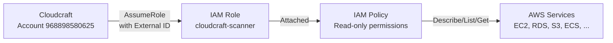

# Architecture

This document explains how the Cloudcraft IAM role module works.

## Overview

The module creates three AWS resources to establish a secure cross-account trust relationship
between your AWS account and Cloudcraft's AWS account (`968898580625`).

## Components

### IAM Role (`cloudcraft-scanner`)

The IAM role has a trust policy that allows only Cloudcraft's AWS account to assume it.
The trust policy includes an **external ID condition** — Cloudcraft must present the correct
external ID when calling `sts:AssumeRole`. This prevents the
[confused deputy problem](https://docs.aws.amazon.com/IAM/latest/UserGuide/confused-deputy.html).

### IAM Policy

A single IAM policy is attached to the role granting read-only access across 30+ AWS services.
All actions are scoped to `Describe*`, `List*`, `Get*`, and `Select` — no write permissions
are granted.

The policy uses two statements:

1. **API Gateway** — Scoped to specific API Gateway resource ARN patterns
2. **All other services** — Uses `"*"` as the resource since describe/list actions
   cannot be scoped to specific ARNs

### External ID

The external ID is a UUID provided by Cloudcraft that is unique to your account. It acts as
a shared secret between you and Cloudcraft, ensuring that only Cloudcraft (and not a malicious
third party) can assume the role.

## Security Considerations

- **Read-only access** — The role cannot modify, create, or delete any resources
- **External ID validation** — Prevents confused deputy attacks
- **Single-purpose role** — The role is exclusively for Cloudcraft, not shared with other services
- **No data access** — The role can list S3 buckets and their metadata but cannot read object contents
